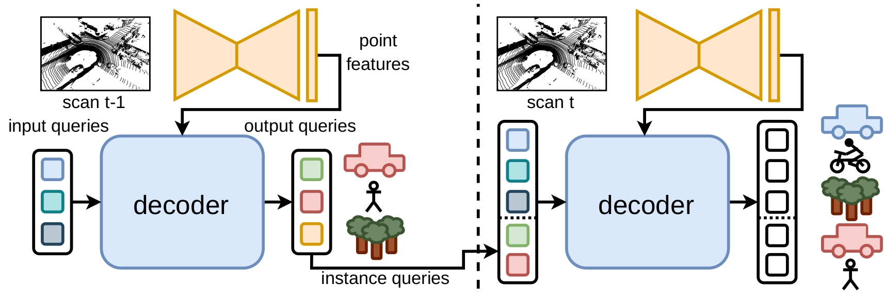

# Mask4D: End-to-End Mask-Based 4D Panoptic Segmentation for LiDAR Sequences

This is the official implementation of [Mask4D](https://www.ipb.uni-bonn.de/wp-content/papercite-data/pdf/marcuzzi2023ral-meem.pdf).

## Overview
* Mask4D is a method for 4D panoptic segmentation using masks. It builds on top of [MaskPLS](https://github.com/PRBonn/MaskPLS) using [SphereFormer](https://github.com/dvlab-research/SphereFormer/tree/master) as feature extractor.
* We reuse the output queries of previous steps to decode and track the same instance over time.
* It is an end-to-end approach without post-processing step like clustering.
* We propose Position-aware mask attention to provide prior positional information to the cross-attention and improve the segmentation.



## Get started

Install this package by running in the root directory of this repo:
```
pip3 install -U -e .
```

Install pdependencies (we test on python=3.8.10, pytorch==1.12.0, cuda==11.3)

```
pip3 install torch==1.12.0+cu113 torchvision==0.13.0+cu113 --extra-index-url https://download.pytorch.org/whl/cu113
pip3 install -r requirements.txt
```

Install [SparseTransformer](https://github.com/dvlab-research/SparseTransformer).

## Data preparation: SemanticKITTI
Download the [SemanticKITTI](http://www.semantic-kitti.org/dataset.html#overview) dataset inside the directory `data/kitti/`. The directory structure should look like this:
```
./
└── data/
    └── kitti
        └── sequences
            ├── 00/           
            │   ├── velodyne/	
            |   |	├── 000000.bin
            |   |	├── 000001.bin
            |   |	└── ...
            │   └── labels/ 
            |       ├── 000000.label
            |       ├── 000001.label
            |       └── ...
            ├── 08/ # for validation
            ├── 11/ # 11-21 for testing
            └── 21/
                └── ...
```

## Pretrained models

* [Mask4D](https://www.ipb.uni-bonn.de/html/projects/mask_4d/mask4d.ckpt)
* [MaskPLS](https://www.ipb.uni-bonn.de/html/projects/mask_4d/maskpls.ckpt)

## Reproducing results
```
python3 scripts/evaluate_model.py --w [path_to_4D_model]
```

## Training

We leverage the weights of the 3D model MaskPLS with SphereFormer as backbone.

```
python3 scripts/train_model.py --w [path_to_3D_model]

```

## Citation
```bibtex
@article{marcuzzi2023ral-meem,
  author = {R. Marcuzzi and L. Nunes and L. Wiesmann and E. Marks and J. Behley and C. Stachniss},
  title = {{Mask4D: End-to-End Mask-Based 4D Panoptic Segmentation for LiDAR Sequences}},
  journal = ral,
  year = 2023,
  url = {https://www.ipb.uni-bonn.de/wp-content/papercite-data/pdf/marcuzzi2023ral-meem.pdf},
}
```
